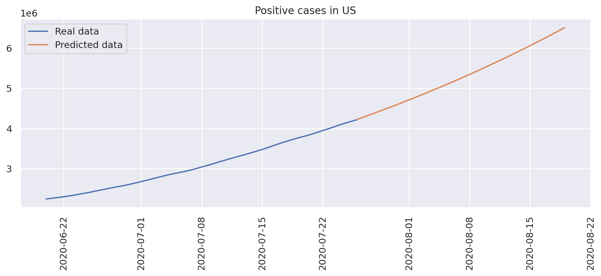

# #BuildwithAI Predictive Algorithm Challenge

  

 
<a href="https://www.youtube.com/watch?v=ujBxDDCPDtE">Video Presentation</a>
 

## Problem

The sudden appearance of COVID-19 has changed the world as we know it. Accurate predictions are a key tool to take proper decisions and foresee future issues.

## Our Solution

Our proposed predictive algorithm combines epidemiology models and genetic algorithms. As epidemiology model, we decided to use SEIRS: Acronym of susceptible , exposed, infectious, recovered and re-susceptible.

  

However, this model depends on a set of parameters and its resulting prediction changes based on them. So, we want to find the set of parameters that better fits the current curve of positive cases, expecting that the model will generalize to the following days we want to predict.

We propose to estimate the best set of parameters based on a Genetic Algorithm. The Genetic Algorithm considers several sets of parameters, re-combines them, and makes mutations to look for the parameters that better fit the current curve.

We apply our proposed algorithm to each state separately, obtaining specialized models capable of handling the specific conditions of each state.

## Resutls

Finally, aggregating results from each state, we obtain our final prediction curve.

## Team Make Unicorns Great Again

* Raquel Leandra Pérez Arnal
* Dmitry Gnatyshak
* Ferran Parés
* Manuel Gijón Agudo
* Dídac Fernández Cadenas
* Leo Lamsdorff
* Idril Geer
